# 🏗️ Arquitectura de Infraestructura - TimeTrack

## 📊 Diagrama de Infraestructura en la Nube

```mermaid
graph TB
    subgraph "🌐 Usuario"
        Mobile["📱 TimeTrack Mobile<br/>(React Native/Expo)"]
    end
    
    subgraph "☁️ Supabase Cloud (PostgreSQL + Auth + Storage)"
        subgraph "🔐 Supabase Auth"
            Auth["Authentication Service<br/>• Email/Password<br/>• OTP Email<br/>• TOTP 2FA<br/>• JWT Tokens"]
        end
        
        subgraph "💾 Supabase Database (PostgreSQL)"
            DB["PostgreSQL Database<br/>┌─────────────────────────┐<br/>│ • profiles              │<br/>│ • sesiones_trabajo      │<br/>│ • horarios_asignados    │<br/>│ • rutinas               │<br/>│ • chat_history          │<br/>│ • settings              │<br/>└─────────────────────────┘<br/><br/>🔒 Row Level Security (RLS)<br/>• Users can only access their data<br/>• Policies per table<br/>• Automatic row isolation"]
        end
        
        subgraph "📦 Supabase Storage"
            Storage["Supabase Storage<br/>┌──────────────────────────┐<br/>│ 📁 avatars/              │<br/>│ • Avatar images          │<br/>│ • Public read access     │<br/>│ • Private write access   │<br/>│ • Auto-resize/crop       │<br/>└──────────────────────────┘"]
        end
    end
    
    subgraph "🤖 Google Gemini AI"
        Gemini["Gemini 2.0 Flash Exp<br/>┌──────────────────────────┐<br/>│ • Natural Language       │<br/>│ • Intent Analysis        │<br/>│ • Contextual Responses   │<br/>│ • Smart Actions          │<br/>│ • 15 req/min (free)      │<br/>└──────────────────────────┘<br/><br/>📊 Capabilities:<br/>• Conversational AI<br/>• Entity Extraction<br/>• Intent Detection<br/>• Action Automation"]
    end
    
    subgraph "💾 Almacenamiento Local"
        LocalStorage["📱 AsyncStorage<br/>┌──────────────────────────┐<br/>│ • Session tokens         │<br/>│ • Theme preferences      │<br/>│ • Settings cache         │<br/>│ • Temp data              │<br/>└──────────────────────────┘"]
    end
    
    %% Conexiones
    Mobile -->|HTTPS/REST API| Auth
    Mobile -->|HTTPS/REST API| DB
    Mobile -->|HTTPS/Upload| Storage
    Mobile -->|HTTPS/API| Gemini
    Mobile <-->|Local| LocalStorage
    
    Auth -->|Manage| DB
    Auth -.->|User Data| Storage
    
    DB -.->|Uses| RLS["🔒 Row Level Security<br/>Policies"]
    RLS -.->|Protects| DB
    
    %% Estilos
    classDef mobile fill:#667eea,stroke:#4c51bf,stroke-width:3px,color:#fff
    classDef supabase fill:#3ecf8e,stroke:#2dd4bf,stroke-width:2px,color:#fff
    classDef gemini fill:#4285f4,stroke:#34a853,stroke-width:2px,color:#fff
    classDef storage fill:#f59e0b,stroke:#d97706,stroke-width:2px,color:#fff
    
    class Mobile mobile
    class Auth,DB supabase
    class Storage supabase
    class Gemini gemini
    class LocalStorage storage
```



## 🔄 Flujos de Datos

### 1️⃣ Flujo de Autenticación

```mermaid
sequenceDiagram
    participant U as Usuario
    participant M as Mobile App
    participant A as Supabase Auth
    participant D as PostgreSQL DB
    
    U->>M: Ingresar email/password
    M->>A: POST /auth/v1/token
    A->>D: Verificar credenciales
    D-->>A: Usuario válido
    A->>D: Verificar 2FA habilitado
    D-->>A: 2FA: true
    A-->>M: Enviar OTP por email
    M->>U: Mostrar pantalla OTP
    U->>M: Ingresar código OTP
    M->>A: POST /auth/v1/verify
    A->>D: Verificar código
    D-->>A: Código válido
    A->>A: Generar JWT
    A-->>M: Access Token + User Data
    M->>M: Guardar en AsyncStorage
    M->>U: Navegar a Dashboard
```



### 2️⃣ Flujo de Gestión de Sesiones

```mermaid
sequenceDiagram
    participant U as Usuario
    participant M as Mobile App
    participant D as PostgreSQL DB
    participant RLS as RLS Policies
    
    U->>M: Iniciar Sesión de Trabajo
    M->>M: Obtener JWT de AsyncStorage
    M->>D: INSERT sesiones_trabajo
    RLS->>D: Verificar auth.uid() = user_id
    D-->>M: Nueva sesión creada (id: 123)
    M->>U: Mostrar "Sesión activa"
    
    Note over M,U: Usuario trabaja...
    
    U->>M: Finalizar Sesión
    M->>M: Calcular duración
    M->>D: UPDATE sesiones_trabajo SET activa=false
    RLS->>D: Verificar auth.uid() = user_id AND id=123
    D->>D: Actualizar registro
    D-->>M: Sesión finalizada
    M->>U: Mostrar resumen de tiempo
```



### 3️⃣ Flujo de Chat con IA (Gemini)

```mermaid
sequenceDiagram
    participant U as Usuario
    participant M as Mobile App
    participant CS as AIChatService
    participant G as Gemini API
    participant D as PostgreSQL DB
    
    U->>M: "Inicia mi rutina de ejercicio"
    M->>CS: processMessage(userMessage, userId)
    CS->>D: Obtener contexto completo
    Note over D: rutinas, horarios, sesiones, stats
    D-->>CS: Contexto del usuario
    CS->>G: POST /generate (con contexto)
    G->>G: Analyze intent + contexto
    G-->>CS: Intent: start_routine + AI response
    CS->>CS: Identificar rutina "ejercicio"
    CS->>D: INSERT chat_history (user message)
    CS->>D: INSERT chat_history (assistant response)
    CS->>G: Execute action (start_routine)
    G-->>CS: Action executed
    CS-->>M: Respuesta AI + Action type
    M->>U: Mostrar respuesta + ejecutar acción
```



### 4️⃣ Flujo de Upload de Avatar

```mermaid
sequenceDiagram
    participant U as Usuario
    participant M as Mobile App
    participant SS as Supabase Storage
    participant D as PostgreSQL DB
    
    U->>M: Seleccionar nueva foto
    M->>M: Capturar/Seleccionar imagen
    M->>M: Comprimir imagen
    M->>SS: POST /storage/v1/object/avatars/{userId}
    SS->>SS: Verificar políticas de acceso
    SS->>SS: Upload y optimizar imagen
    SS-->>M: URL pública del avatar
    M->>D: UPDATE profiles SET avatar_url='...'
    D-->>M: Perfil actualizado
    M->>M: Guardar URL localmente
    M->>U: Mostrar nueva foto
```



## 🗂️ Arquitectura de Base de Datos

### Esquema de Relaciones


## 🔐 Seguridad y Protección de Datos

### Row Level Security (RLS) Policies

```mermaid
graph TB
    subgraph "🔒 RLS Policies"
        P1["Profiles<br/>• SELECT: auth.uid() = id<br/>• UPDATE: auth.uid() = id<br/>• INSERT: auth.uid() = id"]
        P2["Sesiones<br/>• SELECT: auth.uid() = user_id<br/>• INSERT: auth.uid() = user_id<br/>• UPDATE: auth.uid() = user_id<br/>• DELETE: auth.uid() = user_id"]
        P3["Horarios<br/>• SELECT: auth.uid() = user_id<br/>• INSERT: auth.uid() = user_id<br/>• UPDATE: auth.uid() = user_id<br/>• DELETE: auth.uid() = user_id"]
        P4["Rutinas<br/>• SELECT: auth.uid() = user_id<br/>• INSERT: auth.uid() = user_id<br/>• UPDATE: auth.uid() = user_id<br/>• DELETE: auth.uid() = user_id"]
        P5["Chat History<br/>• SELECT: auth.uid() = user_id<br/>• INSERT: auth.uid() = user_id"]
        P6["Settings<br/>• SELECT: auth.uid() = user_id<br/>• UPDATE: auth.uid() = user_id<br/>• INSERT: auth.uid() = user_id"]
    end
    
    classDef policy fill:#f59e0b,stroke:#d97706,stroke-width:2px,color:#fff
    class P1,P2,P3,P4,P5,P6 policy
```



## 📡 Endpoints y Servicios

### Supabase REST API

```
Authentication:
POST   /auth/v1/signup
POST   /auth/v1/token
POST   /auth/v1/logout
POST   /auth/v1/otp
POST   /auth/v1/verify

Database:
GET    /rest/v1/profiles?user_id=eq.{uuid}
POST   /rest/v1/sesiones_trabajo
GET    /rest/v1/sesiones_trabajo?user_id=eq.{uuid}
PUT    /rest/v1/sesiones_trabajo?id=eq.{id}&user_id=eq.{uuid}
DELETE /rest/v1/sesiones_trabajo?id=eq.{id}&user_id=eq.{uuid}

Storage:
POST   /storage/v1/object/avatars/{userId}
GET    /storage/v1/object/public/avatars/{userId}
DELETE /storage/v1/object/avatars/{userId}
```

### Google Gemini API

```
Intent Analysis:
POST /v1beta/models/gemini-2.0-flash-exp:generateContent

Chat Response:
POST /v1beta/models/gemini-2.0-flash-exp:generateContent

Request Headers:
Authorization: Bearer {API_KEY}

Rate Limit:
15 requests/minute (free tier)
```

## 🌐 Despliegue y Escalabilidad

### Arquitectura de Despliegue


### Capacidad y Límites

```
Supabase Database:
- Plan gratuito: 500 MB storage
- Plan pro: 8 GB storage
- Máximo de conexiones: 50 (free), 200+ (pro)
- Backup automático diario

Supabase Auth:
- Usuarios ilimitados
- Rate limiting: 500 req/min
- JWT expiration: 1 hora

Gemini API:
- Rate limit: 15 req/min (free)
- Tokens: ~1 token = 4 caracteres
- Context window: Grande

Storage:
- Plan gratuito: 1 GB
- Max file size: 50 MB
- Auto-resize images
```

## 🔄 Flujo de Sincronización

```mermaid
graph TB
    subgraph "📱 Mobile App"
        Local["AsyncStorage Local"]
        Cache["Memory Cache"]
    end
    
    subgraph "☁️ Supabase"
        Remote["PostgreSQL DB"]
        Real["Realtime Subscription"]
    end
    
    Local -->|Read/Write| Cache
    Cache -->|Sync On Demand| Remote
    Remote -.->|Real-time Updates| Real
    Real -.->|Push Updates| Cache
    
    style Local fill:#667eea,stroke:#4c51bf,stroke-width:2px,color:#fff
    style Remote fill:#3ecf8e,stroke:#2dd4bf,stroke-width:2px,color:#fff
    style Real fill:#f59e0b,stroke:#d97706,stroke-width:2px,color:#fff
```



## 📊 Monitoreo y Analytics

### Métricas Clave

```
User Engagement:
- Active users per day
- Sessions per user
- Average session duration
- Feature usage statistics

Performance:
- API response time
- Database query performance
- Storage usage
- Network latency

AI Usage:
- Gemini API calls
- Intent accuracy
- Response time
- Token consumption

Error Tracking:
- Error rates
- Crash reports
- Failed auth attempts
- API errors
```

---

**Infraestructura**: Serverless | Auto-scaling | Multi-region | Secure

**TimeTrack** - Construido sobre Supabase + Gemini AI 🤖

